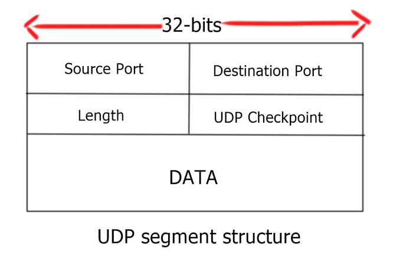

### 一、udp协议介绍

1、**udp是一个简单的面向数据报的传输层协议。**（面向数据报的意思就是每次用户需要发送多大的数据，udp都直接打包，然后发送出去，无论多大或多小。这区别于tcp面向字节流，tcp会自动调整每次发送数据量的大小，太大的就拆分成不同的小块，小的就等大一点再一起发出去）

​	当然，如果udp给ip的数据报太大的话，ip层可能会分片，但是udp不管，只要保证发送和接受的都是一个完整的udp数据报就行。

2、**udp不保证数据传输可靠性，如果丢包的话就算了。**对方会发送ICMP差错报文说明该数据报丢失的原因，但是udp不会再次传输该数据报

3、**无连接，**数据传输的双方并不需要建立连接，随时可以发送和接收。

4、**无序性**，接收方接收的无序性，发送方依次发送1,2，3三个包，但是接收方可能不会按照这个顺序进行接收。

### 二、udp首部

​	udp的首部共8个字节。

1、源端口和目的端口：标识着源主机和目的主机的不同端口，对应不同的进程。（tcp和udp拥有各自独立的端口号）

2、长度：udp长度包括了udp首部和udp数据的总大小，单位为字节。

3、校验和（16位的校验和）：包含对ip首部、udp首部和udp数据一起进行校验。

### 三、udp校验和

1、校验的内容包括三个部分：伪首部（12个字节，包含ip首部的一些内容。主要包括32位的源ip地址、32位的目的ip地址、8位保留字节(置0)、8位传输层协议号(TCP是6，UDP是17)、16位报文长度(首部+数据)） 、udp首部（8个字节）、udp数据。

如果udp数据部分是奇数个字节（不是16bit的倍数的话），那么要补充多一个全为0的字节。

2、校验流程：

**接收端**：

​	首先，把伪首部、udp报头、udp数据分为16位的字，如果总长度为奇数个字节，则在最后增添一个位都为0的字节。

​	用反码相加法（对每16bit进行二进制反码求和）累加所有的16位字（进位也要累加，进位则将高位叠加到低位）。

​	把校验和存在校验字段中。

**发送端**：

​	利用反码求和，高位叠加到低位， 如计算结果的16位中每一位都为1，则正确，否则说明发生错误。

3、为什么校验要加上ip首部部分内容？

​	双重校验，保证接收到完全正确的数据。

### 四、udp丢包问题

**（1）UDP socket缓冲区满造成的UDP丢包**

​	通过 cat /proc/sys/net/core/rmem_default 和cat /proc/sys/net/core/rmem_max可以查看socket缓冲区的缺省值和最大值。

​	**如果socket缓冲区满了，应用程序没来得及处理在缓冲区中的UDP包，那么后续来的UDP包会被内核丢弃，造成丢包**。在socket缓冲区满造成丢包的情况下，可以通过增大缓冲区的方法来缓解UDP丢包问题。但是，如果服务已经过载了，简单的增大缓冲区并不能解决问题，反而会造成滚雪球效应，造成请求全部超时，服务不可用。

**（2）UDP socket缓冲区过小造成的UDP丢包**

​	如果Client发送的UDP报文很大，而socket缓冲区过小无法容下该UDP报文，那么该报文就会丢失。

**（3） ARP缓存过期导致UDP丢包**

​	ARP的缓存时间约10分钟，APR缓存列表没有对方的MAC地址或缓存过期的时候，会发送ARP请求获取MAC地址，在没有获取到MAC地址之前，用户发送出去的UDP数据包会被内核缓存到arp_queue这个队列中，默认最多缓存3个包，多余的UDP包会被丢弃。被丢弃的UDP包可以从/proc/net/stat/arp_cache的最后一列的unresolved_discards看到。当然我们可以通过echo 30 > /proc/sys/net/ipv4/neigh/eth1/unres_qlen来增大可以缓存的UDP包。
​	UDP的丢包信息可以从cat /proc/net/udp 的最后一列drops中得到，而倒数第四列inode是丢失UDP数据包的socket的全局唯一的虚拟i节点号，可以通过这个inode号结合lsof(lsof -P -n | grep 25445445)来查到具体的进程。

### 五、udp单播、广播和组播

​	单播用于两个主机之间的端对端通信，广播用于一个主机对整个局域网上所有主机上的数据通信。单播和广播是两个极端，要么对一个主机进行通信，要么对整个局域网上的主机进行通信。实际情况下，经常需要对一组特定的主机进行通信，而不是整个局域网上的所有主机，这就是多播的用途。

1、广播

​	广播UDP与单播UDP的区别就是IP地址不同，**广播使用广播地址255.255.255.255**，**将消息发送到在同一广播网络上的每个主机**。值得强调的是：**本地广播信息是不会被路由器转发**。当然这是十分容易理解的，因为如果路由器转发了广播信息，那么势必会引起网络瘫痪。这也是为什么IP协议的设计者故意没有定义互联网范围的广播机制。

​	广播地址通常用于在网络游戏中处于同一本地网络的玩家之间交流状态信息等。

　　其实广播顾名思义，就是想局域网内所有的人说话，**但是广播还是要指明接收者的端口号的**，因为不可能接受者的所有端口都来收听广播。

具体的代码详见当前目录下面的src文件夹。

2、多播

**（1）多播的概念**
　　多播，也称为“组播”，将网络中同一业务类型主机进行了逻辑上的分组，进行数据收发的时候其数据仅仅在同一分组中进行，其他的主机没有加入此分组不能收发对应的数据。

　　**在广域网上广播的时候，其中的交换机和路由器只向需要获取数据的主机复制并转发数据。**主机可以向路由器请求加入或退出某个组，网络中的路由器和交换机有选择地复制并传输数据，将数据仅仅传输给组内的主机。多播的这种功能，可以一次将数据发送到多个主机，又能保证不影响其他不需要（未加入组）的主机的其他通 信。

相对于传统的一对一的单播，多播具有如下的优点：

　　1、具有同种业务的主机加入同一数据流，共享同一通道，节省了带宽和服务器的优点，具有广播的优点而又没有广播所需要的带宽。

　　2、服务器的总带宽不受客户端带宽的限制。由于组播协议由接收者的需求来确定是否进行数据流的转发，所以服务器端的带宽是常量，与客户端的数量无关。

　　3、与单播一样，多播是允许在广域网即Internet上进行传输的，而广播仅仅在同一局域网上才能进行。

组播的缺点：

　　1、多播与单播相比没有纠错机制（没有ICMP差错报文），当发生错误的时候难以弥补，但是可以在应用层来实现此种功能。

　　2、多播的网络支持存在缺陷，需要路由器及网络协议栈的支持。

　　3、多播的应用主要有网上视频、网上会议等。

**（2）广域网的多播**

​	多播的地址是特定的，D类地址用于多播。D类IP地址就是多播IP地址，即224.0.0.0至239.255.255.255之间的IP地址，并被划分为局部连接多播地址、预留多播地址和管理权限多播地址3类：

　　1、局部多播地址：在224.0.0.0～224.0.0.255之间，这是为路由协议和其他用途保留的地址，路由器并不转发属于此范围的IP包。

　　2、预留多播地址：在224.0.1.0～238.255.255.255之间，可用于全球范围（如Internet）或网络协议。

　　3、管理权限多播地址：在239.0.0.0～239.255.255.255之间，可供组织内部使用，类似于私有IP地址，不能用于Internet，可限制多播范围。

　　多播的程序设计使用setsockopt()函数和getsockopt()函数来实现，组播的选项是IP层的，其选项值和含义如下图所示。

（3）多播程序的设计框架

​	建立一个socket。

​	然后设置多播的参数，例如超时时间TTL、本地回环许可LOOP等。

​	加入多播组。

​	发送和接收数据。

​	从多播组离开。

**3、udp多播与单播的比较**

​	广播和单播的处理过程是不同的，单播的数据只是收发数据的特定主机进行处理，而广播的数据整个局域网都进行处理。

例如在一个以太网上有3个主机，主机的配置如表11.4所示。

单播流程：主机A向主机B发送UDP数据报，发送的目的IP为192.168.1.151，端口为 80，目的MAC地址为00:00:00:00:00:02。此数据经过UDP层、IP层，到达数据链路层，数据在整个以太网上传播，在此层中其他主机会 判断目的MAC地址。主机C的MAC地址为00:00:00:00:00:03，与目的MAC地址00:00:00:00:00:02不匹配，数据链路层 不会进行处理，直接丢弃此数据。主机B的MAC地址为00:00:00:00:00:02，与目的MAC地址00:00:00:00:00:02一致，此数据会经过IP层、UDP层，到达接收数据的应用程序。

　　广播的流程：主机A向整个网络发送广播数据，发送的目的IP为192.168.1.255，端口为 80，目的MAC地址为FF:FF:FF:FF:FF:FF。此数据经过UDP层、IP层，到达数据链路层，数据在整个以太网上传播，在此层中其他主机会 判断目的MAC地址。由于目的MAC地址为FF:FF:FF:FF:FF:FF，主机C和主机B会忽略MAC地址的比较（当然，如果协议栈不支持广播，则 仍然比较MAC地址），处理接收到的数据。

　　主机B和主机C的处理过程一致，此数据会经过IP层、UDP层，到达接收数据的应用程序

### 六、特殊的ip地址

**1、0.0.0.0**
严格说来，0.0.0.0已经不是一个真正意义上的IP地址了。它表示的是这样一个集合：所有不清楚的主机和目的网络。这里的"不清楚"是指在本机的路由表里没有特定条目指明如何到达。对本机来说，它就是一个"收容所"，所有不认识的"三无"人员，一律送进去。如果你在网络设置中设置了缺省网关，那么Windows系统会自动产生一个目的地址为0.0.0.0的缺省路由。

 **2、255.255.255.255**

　　限制广播地址。对本机来说，这个地址指本网段内(同一广播域)的所有主机。如果翻译成人类的语言，应该是这样："这个房间里的所有人都注意了！"这个地址不能被路由器转发。

　　**3、127.0.0.1**

　　本机地址，主要用于测试。用汉语表示，就是"我自己"。在Windows系统中，这个地址有一个别名"Localhost"。寻址这样一个地址，是不能把它发到网络接口的。除非出错，否则在传输介质上永远不应该出现目的地址为"127.0.0.1"的数据包。

　　**4、224.0.0.1**

　　组播地址，注意它和广播的区别。从224.0.0.0到239.255.255.255都是这样的地址。224.0.0.1特指所有主机，224.0.0.2特指所有路由器。这样的地址多用于一些特定的程序以及多媒体程序。如果你的主机开启了IRDP(Internet路由发现协议，使用组播功能)功能，那么你的主机路由表中应该有这样一条路由。

　　5、169.254.x.x

　　如果你的主机使用了DHCP功能自动获得一个IP地址，那么当你的DHCP服务器发生故障，或响应时间太长而超出了一个系统规定的时间，Wingdows系统会为你分配这样一个地址。如果你发现你的主机IP地址是一个诸如此类的地址，很不幸，十有八九是你的网络不能正常运行了。

　　**6、10.x.x.x、172.16.x.x～172.31.x.x、192.168.x.x**

　　私有地址，这些地址被大量用于企业内部网络中。一些宽带路由器，也往往使用192.168.1.1作为缺省地址。私有网络由于不与外部互连，因而可能使用随意的IP地址。保留这样的地址供其使用是为了避免以后接入公网时引起地址混乱。使用私有地址的私有网络在接入Internet时，要使用地址翻译(NAT)，将私有地址翻译成公用合法地址。在Internet上，这类地址是不能出现的。

　　对一台网络上的主机来说，它可以正常接收的合法目的网络地址有三种：本机的IP地址、广播地址以及组播地址。  